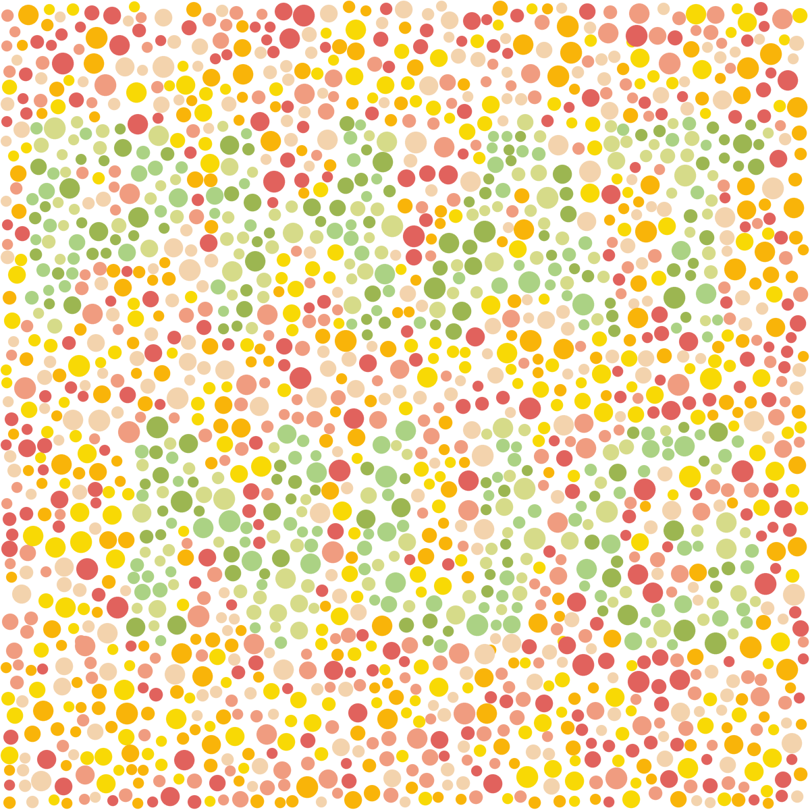
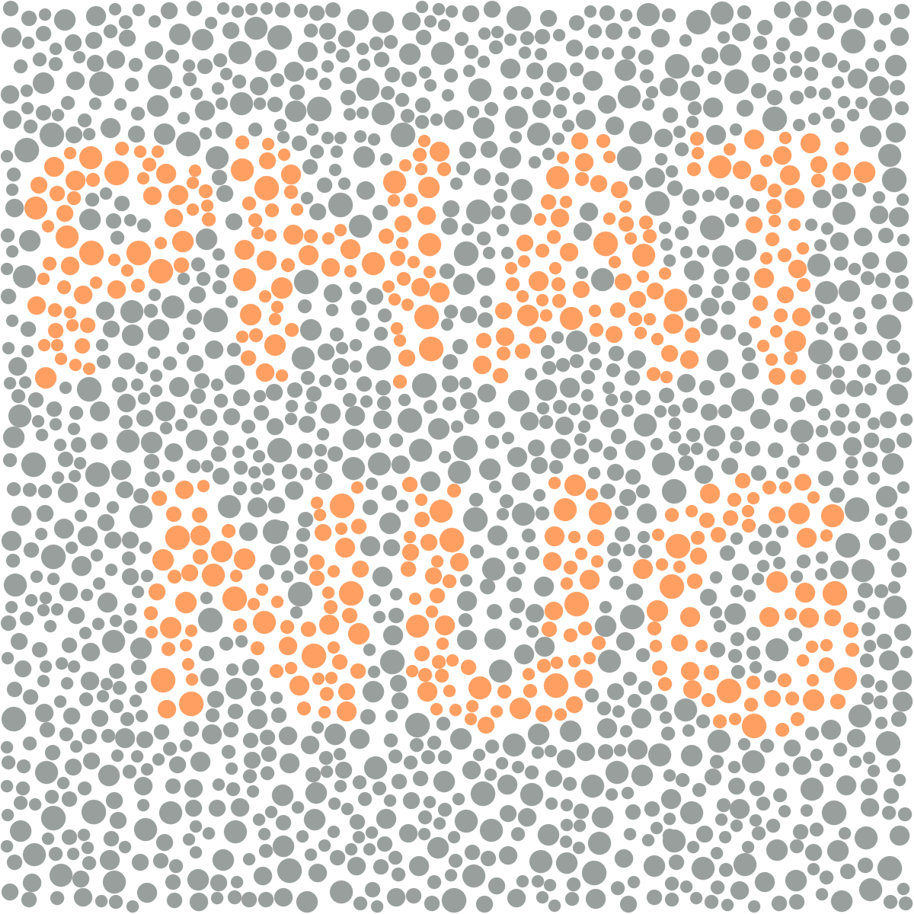
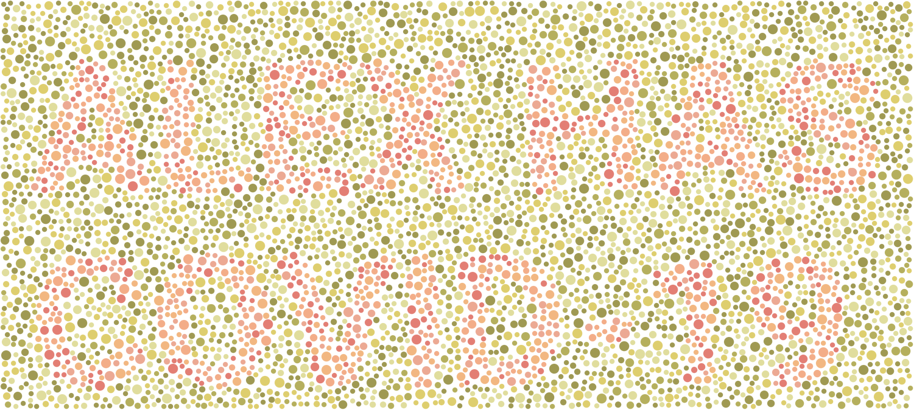
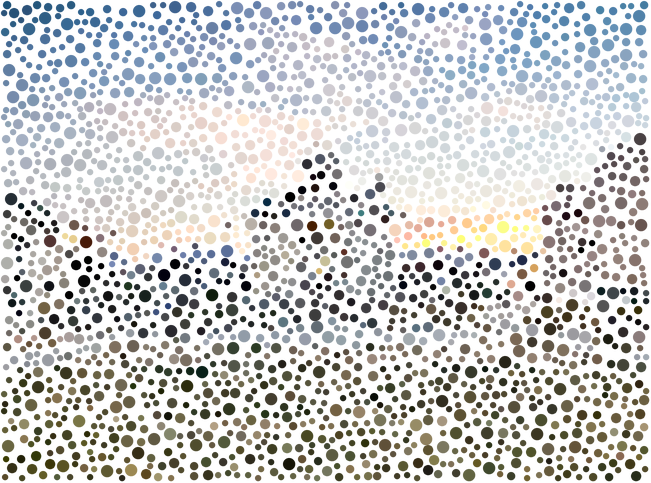

## Ishihara Generator

Instructions:

```
Image -> Ishihara Image
$ setup.sh
$ cd image-generator
$ python3 main.py
```

```
Txt -> Image
$ setup.sh
$ cd text-to-image
$ python3 test.py
```









